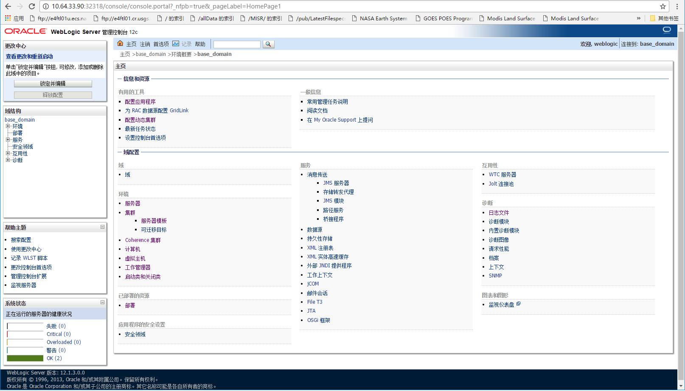
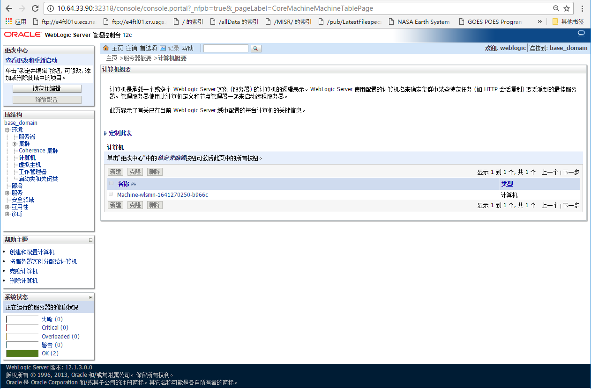
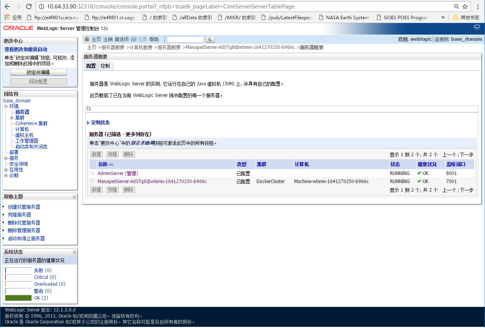

## Content

prerequiretes

* Linux

* Docker

* Kubernetes

### Build

As show in belowing, The 1st dir is for Dockerfile, and 2nd is for JDK and WLS

见下面命令，第一个目录内有Dockerfile，第二个目录是JDK和WLS，并已经解压

    [tangfx@localhost weblogic-docker]$ ls -1
    12.1.3
    download
    
    [tangfx@localhost weblogic-docker]$ ls -1 download/
    jdk1.7.0_80
    wls12130

A simple trial build

执行制作的命令。注意，制作中，当前目录会全部上传到build上下文，如果目录过大，上传时间很长

    [tangfx@localhost weblogic-docker]$ docker build -t tangfeixiong/weblogic:base_domain_12.1.3-serverjre7-centos7 -f Dockerfile.centos7.jdk1.7.0_80.wls12130.base_domain .

### Clustering 

* Admin Server

In Kubernetes, create a *Deployment* called __wlsadmin__

使用Kubernetes命令工具，创建Deploymnet资源，取名为__wlsadmin__。注意，该名称要用于集群节点管理器基于DNS对管理节点进行访问，是Dockerfile内环境变量的默认值

    [tangfx@localhost weblogic-docker]$ kubectl run wlsadmin --image=tangfeixiong/weblogic:base_domain_12.1.3-serverjre7-centos7
    deployment "wlsadmin" created

Check container log for ready

接着，查看容器日志，如下是Weblogic Admin Server的输出

    [tangfx@localhost weblogic-docker]$ kubectl logs $(kubectl get pods -l run=wlsadmin -o jsonpath={.items[0].metadata.name})
    .
    .
    JAVA Memory arguments: -Djava.security.egd=file:/dev/./urandom
    .
    CLASSPATH=/u01/oracle/oracle_common/modules/javax.persistence_2.1.jar:/u01/oracle/wlserver/modules/com.oracle.weblogic.jpa21support_1.0.0.0_2-1.jar:/opt/java/lib/tools.jar:/u01/oracle/wlserver/server/lib/weblogic_sp.jar:/u01/oracle/wlserver/server/lib/weblogic.jar:/u01/oracle/oracle_common/modules/net.sf.antcontrib_1.1.0.0_1-0b3/lib/ant-contrib.jar:/u01/oracle/wlserver/modules/features/oracle.wls.common.nodemanager_2.0.0.0.jar:/u01/oracle/oracle_common/modules/com.oracle.cie.config-wls-online_8.1.0.0.jar:/u01/oracle/wlserver/common/derby/lib/derbyclient.jar:/u01/oracle/wlserver/common/derby/lib/derby.jar:/u01/oracle/wlserver/server/lib/xqrl.jar
    .
    PATH=/u01/oracle/wlserver/server/bin:/u01/oracle/oracle_common/modules/org.apache.ant_1.9.2/bin:/opt/java/jre/bin:/opt/java/bin:/usr/local/sbin:/usr/local/bin:/usr/sbin:/usr/bin:/sbin:/bin:/opt/java/bin:/u01/oracle/oracle_common/common/bin:/u01/oracle/wlserver/common/bin:/u01/oracle/user_projects/domains/base_domain/bin:/u01/oracle
    .
    ***************************************************
    *  To start WebLogic Server, use a username and   *
    *  password assigned to an admin-level user.  For *
    *  server administration, use the WebLogic Server *
    *  console at http://hostname:port/console        *
    ***************************************************
    starting weblogic with Java version:
    java version "1.7.0_80"
    Java(TM) SE Runtime Environment (build 1.7.0_80-b15)
    Java HotSpot(TM) 64-Bit Server VM (build 24.80-b11, mixed mode)
    Starting WLS with line:
    /opt/java/bin/java -server   -Djava.security.egd=file:/dev/./urandom -Dweblogic.Name=AdminServer -Djava.security.policy=/u01/oracle/wlserver/server/lib/weblogic.policy  -Dweblogic.ProductionModeEnabled=true  -Xms512m -Xmx512m -XX:PermSize=128m -XX:MaxPermSize=512m  -Djava.endorsed.dirs=/opt/java/jre/lib/endorsed:/u01/oracle/oracle_common/modules/endorsed  -da -Dwls.home=/u01/oracle/wlserver/server -Dweblogic.home=/u01/oracle/wlserver/server     -Dweblogic.utils.cmm.lowertier.ServiceDisabled=true  weblogic.Server
    <Dec 23, 2016 10:59:16 AM UTC> <Info> <Security> <BEA-090905> <Disabling the CryptoJ JCE Provider self-integrity check for better startup performance. To enable this check, specify -Dweblogic.security.allowCryptoJDefaultJCEVerification=true.>
    <Dec 23, 2016 10:59:16 AM UTC> <Info> <Security> <BEA-090906> <Changing the default Random Number Generator in RSA CryptoJ from ECDRBG128 to FIPS186PRNG. To disable this change, specify -Dweblogic.security.allowCryptoJDefaultPRNG=true.>
    <Dec 23, 2016 10:59:17 AM UTC> <Info> <WebLogicServer> <BEA-000377> <Starting WebLogic Server with Java HotSpot(TM) 64-Bit Server VM Version 24.80-b11 from Oracle Corporation.>
    <Dec 23, 2016 10:59:17 AM UTC> <Info> <Management> <BEA-141107> <Version: WebLogic Server 12.1.3.0.0  Tue Aug 11 09:00:41 UTC 2015 1697938 >
    <Dec 23, 2016 10:59:19 AM UTC> <Notice> <WebLogicServer> <BEA-000365> <Server state changed to STARTING.>
    <Dec 23, 2016 10:59:19 AM UTC> <Info> <WorkManager> <BEA-002900> <Initializing self-tuning thread pool.>
    <Dec 23, 2016 10:59:19 AM UTC> <Info> <WorkManager> <BEA-002942> <CMM memory level becomes 0. Setting standby thread pool size to 256.>
    <Dec 23, 2016 10:59:19 AM UTC> <Notice> <Log Management> <BEA-170019> <The server log file /u01/oracle/user_projects/domains/base_domain/servers/AdminServer/logs/AdminServer.log is opened. All server side log events will be written to this file.>
    <Dec 23, 2016 10:59:23 AM UTC> <Notice> <Security> <BEA-090082> <Security initializing using security realm myrealm.>
    <Dec 23, 2016 10:59:23 AM UTC> <Notice> <Security> <BEA-090083> <Storing boot identity in the file: /u01/oracle/user_projects/domains/base_domain/servers/AdminServer/security/boot.properties.>
    <Dec 23, 2016 10:59:28 AM UTC> <Notice> <WebLogicServer> <BEA-000365> <Server state changed to STANDBY.>
    <Dec 23, 2016 10:59:28 AM UTC> <Notice> <WebLogicServer> <BEA-000365> <Server state changed to STARTING.>
    Dec 23, 2016 10:59:28 AM weblogic.wsee.WseeCoreMessages logWseeServiceStarting
    INFO: The Wsee Service is starting
    <Dec 23, 2016 10:59:35 AM UTC> <Notice> <Log Management> <BEA-170027> <The server has successfully established a connection with the Domain level Diagnostic Service.>
    <Dec 23, 2016 10:59:36 AM UTC> <Notice> <WebLogicServer> <BEA-000365> <Server state changed to ADMIN.>
    <Dec 23, 2016 10:59:36 AM UTC> <Notice> <WebLogicServer> <BEA-000365> <Server state changed to RESUMING.>
    <Dec 23, 2016 10:59:37 AM UTC> <Notice> <Server> <BEA-002613> <Channel "Default" is now listening on 10.120.76.4:8001 for protocols iiop, t3, ldap, snmp, http.>
    <Dec 23, 2016 10:59:37 AM UTC> <Notice> <Server> <BEA-002613> <Channel "Default[1]" is now listening on 0:0:0:0:0:0:0:1:8001 for protocols iiop, t3, ldap, snmp, http.>
    <Dec 23, 2016 10:59:37 AM UTC> <Warning> <Server> <BEA-002611> <The hostname "localhost", maps to multiple IP addresses: 127.0.0.1, 0:0:0:0:0:0:0:1.>
    <Dec 23, 2016 10:59:37 AM UTC> <Notice> <Server> <BEA-002613> <Channel "Default[2]" is now listening on 127.0.0.1:8001 for protocols iiop, t3, ldap, snmp, http.>
    <Dec 23, 2016 10:59:37 AM UTC> <Notice> <WebLogicServer> <BEA-000329> <Started the WebLogic Server Administration Server "AdminServer" for domain "base_domain" running in production mode.>
    <Dec 23, 2016 10:59:37 AM UTC> <Notice> <WebLogicServer> <BEA-000360> <The server started in RUNNING mode.>
    <Dec 23, 2016 10:59:37 AM UTC> <Notice> <WebLogicServer> <BEA-000365> <Server state changed to RUNNING.>

Expose Weblogic Admin Server to external

然后，创建服务访问点

    [tangfx@localhost weblogic-docker]$ kubectl expose deployments/wlsadmin --port=8001 --type=NodePort
    service "wlsadmin" exposed
    
    [tangfx@localhost weblogic-docker]$ kubectl get service/wlsadmin -o jsonpath={.spec..nodePort}
    32318

Now, you may access admin server *console* address like *the.container.host.ip:32318*。 the credential are listed in next *command＊

现在，可以基于上述DNAT端口以容器所在宿主机IP地址（或Kkubnetes集群节点）访问管理控制台web，登录密码和口令见下一命令

* Node 

Create a node pod

创建工作节点，以如下命令

    [tangfx@localhost weblogic-docker]$ kubectl run wlsmn --image=tangfeixiong/weblogic:base_domain_12.1.3-serverjre7-centos7 --env="ADMIN_PASSWORD=weblogic1234%^&*" --command -- sh createServer.sh
    deployment "wlsmn" created

And view log again

以下为Node Manager和Managed Server的日志

    [tangfx@localhost weblogic-docker]$ kubectl logs $(kubectl get pods -l run=wlsmn -o jsonpath={.items[0].metadata.name})
    Waiting for WebLogic Admin Server on wlsadmin:8001 to become available...
    WebLogic Admin Server is now available. Proceeding...
    Starting NodeManager in background...
    NodeManager started.
    
    Initializing WebLogic Scripting Tool (WLST) ...
    
    Welcome to WebLogic Server Administration Scripting Shell
    
    Type help() for help on available commands
    
    Connecting to t3://wlsadmin:8001 with userid weblogic ...
    Successfully connected to Admin Server "AdminServer" that belongs to domain "base_domain".
    
    Warning: An insecure protocol was used to connect to the
    server. To ensure on-the-wire security, the SSL port or
    Admin port should be used instead.
    
    Location changed to edit tree. This is a writable tree with
    DomainMBean as the root. To make changes you will need to start
    an edit session via startEdit().
    
    For more help, use help('edit')
    
    Starting an edit session ...
    Started edit session, please be sure to save and activate your
    changes once you are done.
    You have acquired an exclusive lock, which will cause
    a subsequent call to startEdit by the same owner to wait
    until this edit session lock is releasedSaving all your changes ...
    Saved all your changes successfully.
    Activating all your changes, this may take a while ...
    The edit lock associated with this edit session is released
    once the activation is completed.
    Activation completed
    
    
    Exiting WebLogic Scripting Tool.
    
    
    Initializing WebLogic Scripting Tool (WLST) ...
    
    Welcome to WebLogic Server Administration Scripting Shell
    
    Type help() for help on available commands
    
    Connecting to t3://wlsadmin:8001 with userid weblogic ...
    Successfully connected to Admin Server "AdminServer" that belongs to domain "base_domain".
    
    Warning: An insecure protocol was used to connect to the
    server. To ensure on-the-wire security, the SSL port or
    Admin port should be used instead.
    
    Location changed to edit tree. This is a writable tree with
    DomainMBean as the root. To make changes you will need to start
    an edit session via startEdit().
    
    For more help, use help('edit')
    
    Starting an edit session ...
    Started edit session, please be sure to save and activate your
    changes once you are done.
    You have acquired an exclusive lock, which will cause
    a subsequent call to startEdit by the same owner to wait
    until this edit session lock is releasedSaving all your changes ...
    Saved all your changes successfully.
    Activating all your changes, this may take a while ...
    The edit lock associated with this edit session is released
    once the activation is completed.
    Activation completed
    Starting server ManagedServer-AdSTg8@wlsmn-1641270250-b966c .............................................
    Server with name ManagedServer-AdSTg8@wlsmn-1641270250-b966c started successfully
    
    
    Exiting WebLogic Scripting Tool.
    
    ==> log.nm <==
    <Dec 23, 2016 11:05:29 AM UTC> <INFO> <base_domain> <ManagedServer-AdSTg8@wlsmn-1641270250-b966c> <Creating directory "/u01/oracle/user_projects/domains/base_domain/servers/ManagedServer-AdSTg8@wlsmn-1641270250-b966c/security">
    <Dec 23, 2016 11:05:29 AM UTC> <INFO> <base_domain> <ManagedServer-AdSTg8@wlsmn-1641270250-b966c> <Creating directory "/u01/oracle/user_projects/domains/base_domain/servers/ManagedServer-AdSTg8@wlsmn-1641270250-b966c/tmp">
    <Dec 23, 2016 11:05:29 AM UTC> <INFO> <base_domain> <ManagedServer-AdSTg8@wlsmn-1641270250-b966c> <Boot identity properties saved to "/u01/oracle/user_projects/domains/base_domain/servers/ManagedServer-AdSTg8@wlsmn-1641270250-b966c/data/nodemanager/boot.properties">
    <Dec 23, 2016 11:05:29 AM UTC> <INFO> <base_domain> <ManagedServer-AdSTg8@wlsmn-1641270250-b966c> <Startup configuration properties saved to "/u01/oracle/user_projects/domains/base_domain/servers/ManagedServer-AdSTg8@wlsmn-1641270250-b966c/data/nodemanager/startup.properties">
    <Dec 23, 2016 11:05:29 AM UTC> <INFO> <base_domain> <ManagedServer-AdSTg8@wlsmn-1641270250-b966c> <Server error log also redirected to server log>
    <Dec 23, 2016 11:05:29 AM UTC> <INFO> <base_domain> <ManagedServer-AdSTg8@wlsmn-1641270250-b966c> <Starting WebLogic server with command line: /opt/java/bin/java -Dweblogic.Name=ManagedServer-AdSTg8@wlsmn-1641270250-b966c -Dbea.home=/u01/oracle -Djava.security.policy=/u01/oracle/wlserver/server/lib/weblogic.policy -Dweblogic.management.server=http://10.120.76.4:8001 -Djava.library.path=:/u01/oracle/wlserver/server/native/linux/x86_64:/u01/oracle/wlserver/server/native/linux/x86_64/oci920_8:/usr/java/packages/lib/amd64:/usr/lib64:/lib64:/lib:/usr/lib -Djava.class.path=/opt/java/lib/tools.jar:/u01/oracle/wlserver/server/lib/weblogic_sp.jar:/u01/oracle/wlserver/server/lib/weblogic.jar:/u01/oracle/oracle_common/modules/net.sf.antcontrib_1.1.0.0_1-0b3/lib/ant-contrib.jar:/u01/oracle/wlserver/modules/features/oracle.wls.common.nodemanager_2.0.0.0.jar::/u01/oracle -Dweblogic.system.BootIdentityFile=/u01/oracle/user_projects/domains/base_domain/servers/ManagedServer-AdSTg8@wlsmn-1641270250-b966c/data/nodemanager/boot.properties -Dweblogic.nodemanager.ServiceEnabled=true -Dweblogic.nmservice.RotationEnabled=true -Dweblogic.security.SSL.ignoreHostnameVerification=false -Dweblogic.ReverseDNSAllowed=false -Djava.security.egd=file:/dev/./urandom -Dweblogic.Name=ManagedServer-AdSTg8@wlsmn-1641270250-b966c -Dweblogic.management.server=http://wlsadmin:8001 -Xms512m -Xmx512m -XX:PermSize=256m -XX:MaxPermSize=768m -Djava.security.egd=file:/dev/./urandom weblogic.Server >
    <Dec 23, 2016 11:05:29 AM UTC> <INFO> <base_domain> <ManagedServer-AdSTg8@wlsmn-1641270250-b966c> <Working directory is '/u01/oracle/user_projects/domains/base_domain'>
    <Dec 23, 2016 11:05:29 AM UTC> <INFO> <base_domain> <ManagedServer-AdSTg8@wlsmn-1641270250-b966c> <Server output log file is '/u01/oracle/user_projects/domains/base_domain/servers/ManagedServer-AdSTg8@wlsmn-1641270250-b966c/logs/ManagedServer-AdSTg8@wlsmn-1641270250-b966c.out'>
    <Dec 23, 2016 11:05:29 AM UTC> <FINEST> <base_domain> <ManagedServer-AdSTg8@wlsmn-1641270250-b966c> <Wrote process id 200>
    <Dec 23, 2016 11:06:17 AM UTC> <INFO> <base_domain> <ManagedServer-AdSTg8@wlsmn-1641270250-b966c> <The server 'ManagedServer-AdSTg8@wlsmn-1641270250-b966c' is running now.>
    
    ==> /u01/oracle/user_projects/domains/base_domain/servers/ManagedServer-AdSTg8@wlsmn-1641270250-b966c/logs/ManagedServer-AdSTg8@wlsmn-1641270250-b966c.out <==
    INFO: The Wsee Service is starting
    <Dec 23, 2016 11:06:15 AM UTC> <Notice> <Cluster> <BEA-000197> <Listening for announcements from cluster using unicast cluster messaging>
    <Dec 23, 2016 11:06:15 AM UTC> <Notice> <Log Management> <BEA-170027> <The server has successfully established a connection with the Domain level Diagnostic Service.>
    <Dec 23, 2016 11:06:16 AM UTC> <Notice> <WebLogicServer> <BEA-000365> <Server state changed to ADMIN.>
    <Dec 23, 2016 11:06:16 AM UTC> <Notice> <WebLogicServer> <BEA-000365> <Server state changed to RESUMING.>
    <Dec 23, 2016 11:06:16 AM UTC> <Notice> <Server> <BEA-002613> <Channel "Default" is now listening on 10.120.76.2:7001 for protocols iiop, t3, CLUSTER-BROADCAST, ldap, snmp, http.>
    <Dec 23, 2016 11:06:16 AM UTC> <Notice> <WebLogicServer> <BEA-000330> <Started the WebLogic Server Managed Server "ManagedServer-AdSTg8@wlsmn-1641270250-b966c" for domain "base_domain" running in production mode.>
    <Dec 23, 2016 11:06:16 AM UTC> <Notice> <Cluster> <BEA-000162> <Starting "async" replication service with remote cluster address "null">
    <Dec 23, 2016 11:06:17 AM UTC> <Notice> <WebLogicServer> <BEA-000360> <The server started in RUNNING mode.>
    <Dec 23, 2016 11:06:17 AM UTC> <Notice> <WebLogicServer> <BEA-000365> <Server state changed to RUNNING.>

Now the node is joining

这时，节点已经加入，如下列2图

 

